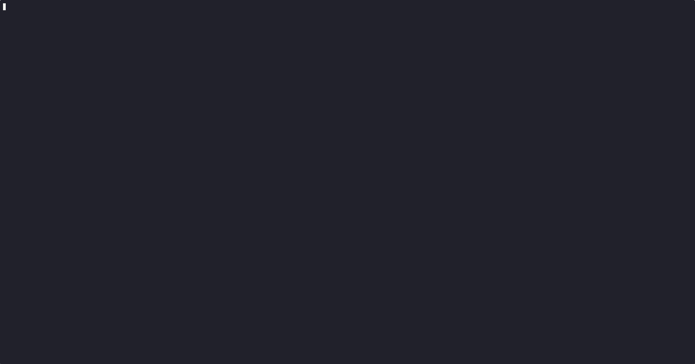

<div id="top">

<!-- HEADER STYLE: CLASSIC -->
<div align="center">


# Silicon Trail

<em>Don't forget to pay the AWS bills</em>

<!-- BADGES -->

[//]: # ()


[//]: # ()

[//]: # ()


</div>

<br>



<br>

---

## Deliverables

- See [deliverables-and-req.md](notes/deliverables-and-req.md)

## Game Design

- See [game-design-doc.md](notes/game-design-doc.md)

### API Choices

- [random.org](https://www.random.org/)
- [HackerNews Algolia](https://hn.algolia.com)

<br>

<br>

---

<br>

## Table of Contents

- [Table of Contents](#table-of-contents)
- [Getting Started](#getting-started)
  - [Prerequisites](#prerequisites)
  - [Installation](#installation)
  - [Usage](#usage)
  - [Testing](#testing)
- [Project Structure](#project-structure)
  - [Project Index](#project-index)

<br>

---

## Quick Start

### Installation

Build svt from the source and install dependencies:

1. **Clone the repository:**

```sh
git clone https://github.com/jwc20/svt
```

2. **Navigate to the project directory:**

```sh
cd svt
```

3. **Install:**

**Using [go modules](https://golang.org/):**

```sh
go build -o svt cmd/ssh # build the binary
./svt                   # run
```

### Usage

Run the project with:

**Using [go modules](https://golang.org/):**
```sh
# If the binary is built
go build -o svt cmd/ssh 
./svt

# If the binary is not built
go run ./cmd/ssh
```

After running the Wish server, you can connect to it using SSH:

```sh
ssh localhost -p 23234

# or
ssh player_name@localhost -p 23234
```


### Testing

Svt uses the {__test_framework__} test framework. Run the test suite with:

**Using [go modules](https://golang.org/):**
```sh
go test ./...
```

When writing the game engine tests, I ran my [sniffy](https://github.com/jwc20/sniffy) tool to automatically run the tests whenever I made a change to the code.

---

## AI Uses

- See [ai_uses](notes/ai-uses.md)

## Dependencies

- [Bubble Tea v2](https://charm.land/bubbletea) 
- [Wish SSH v2](https://charm.land/wish)
- [Lipgloss v2](https://charm.land/lipgloss)
- [Bubbles v2](https://charm.land/bubbles) for tables and viewports
- [joho/godotenv](https://github.com/joho/godotenv) for loading environment variables
- [mattn/go-sqlite3](https://github.com/mattn/go-sqlite3) SQLite driver for Go
- [stretchr/testify](https://github.com/stretchr/testify) for writing asserts

---


## Project Structure

This application uses the [Bubble Tea v2 framework](https://github.com/charmbracelet/bubbletea) for terminal user interfaces and the [lipgloss](https://github.com/charmbracelet/lipgloss) library for styling.

It uses [Wish](https://github.com/charmbracelet/wish) to provide a secure SSH connection to the server.

The core game logic and API client is in the `internal/engine`, `internal/rand`, and `internal/hackernews` directories.

```sh
└── svt/
    ├── README.md
    ├── cmd
    │   └── ssh              # SSH Wish Server
    ├── go.mod
    ├── go.sum
    ├── internal
    │   ├── engine           # Game Logic
    │   ├── rand             # Random Number Generation API Client
    │   ├── hackernews       # Hacker News API Client
    │   ├── store            # SQLite Database
    │   └── ui               # Bubble Tea Terminal User Interface
    └── notes
```

### Project Index

<details open>
	<summary><b><code>SVT/</code></b></summary>
	<!-- __root__ Submodule -->
	<details>
		<summary><b>__root__</b></summary>
		<blockquote>
			<div class='directory-path' style='padding: 8px 0; color: #666;'>
				<code><b>⦿ __root__</b></code>
			<table style='width: 100%; border-collapse: collapse;'>
			<thead>
				<tr style='background-color: #f8f9fa;'>
					<th style='width: 30%; text-align: left; padding: 8px;'>File Name</th>
					<th style='text-align: left; padding: 8px;'>Summary</th>
				</tr>
			</thead>
				<tr style='border-bottom: 1px solid #eee;'>
					<td style='padding: 8px;'><b><a href='https://github.com/jwc20/svt/blob/master/go.mod'>go.mod</a></b></td>
					<td style='padding: 8px;'>- The go.mod file defines the module path and specifies the dependencies required for the project, ensuring compatibility with Go version 1.25.8<br>- It includes both direct and indirect dependencies, facilitating the integration of various libraries for functionalities such as UI components, logging, SSH, environment configuration, and database interaction<br>- This setup supports the projects architecture by managing external packages efficiently.</td>
				</tr>
				<tr style='border-bottom: 1px solid #eee;'>
					<td style='padding: 8px;'><b><a href='https://github.com/jwc20/svt/blob/master/go.sum'>go.sum</a></b></td>
					<td style='padding: 8px;'>- The <code>go.sum</code> file is a critical component of the projects dependency management system<br>- It serves as a checksum file that ensures the integrity and consistency of the Go modules used within the codebase<br>- By recording the cryptographic hashes of the module versions, it guarantees that the exact versions of dependencies are used across different environments, preventing discrepancies and potential issues during builds or deployments<br>- This file is automatically generated and updated by the Go toolchain, reflecting the projects reliance on specific versions of external libraries, such as <code>charm.land/bubbles/v2</code> and <code>charm.land/bubbletea/v2</code><br>- Its presence is essential for maintaining a stable and reproducible build process, aligning with the overall architecture's goal of reliability and consistency.</td>
				</tr>
				<tr style='border-bottom: 1px solid #eee;'>
					<td style='padding: 8px;'><b><a href='https://github.com/jwc20/svt/blob/master/demo.cast'>demo.cast</a></b></td>
					<td style='padding: 8px;'>- The <code>demo.cast</code> file is a terminal session recording that serves as a demonstration tool within the project<br>- Its primary purpose is to provide users with a visual and interactive guide on how to utilize the projects features effectively<br>- By replaying this recording, users can observe step-by-step instructions and commands executed in a terminal environment, which can be particularly beneficial for onboarding new users or illustrating complex workflows<br>- This file complements the projects documentation by offering a practical, real-time example of the software in action, enhancing user understanding and engagement.</td>
				</tr>
			</table>
		</blockquote>
	</details>
	<!-- notes Submodule -->
	<details>
		<summary><b>notes</b></summary>
		<blockquote>
			<div class='directory-path' style='padding: 8px 0; color: #666;'>
				<code><b>⦿ notes</b></code>
			<table style='width: 100%; border-collapse: collapse;'>
			<thead>
				<tr style='background-color: #f8f9fa;'>
					<th style='width: 30%; text-align: left; padding: 8px;'>File Name</th>
					<th style='text-align: left; padding: 8px;'>Summary</th>
				</tr>
			</thead>
				<tr style='border-bottom: 1px solid #eee;'>
					<td style='padding: 8px;'><b><a href='https://github.com/jwc20/svt/blob/master/notes/oregon_trail_detailed_model.mermaid'>oregon_trail_detailed_model.mermaid</a></b></td>
					<td style='padding: 8px;'>- Visualizes the decision-making process and potential events in the Oregon Trail game using a flowchart<br>- Highlights key actions such as stopping at a fort, hunting, and continuing the journey, while also depicting possible challenges like attacks, misfortunes, and illnesses<br>- Aids in understanding the games dynamic progression and the interconnectedness of various events and decisions within the gameplay experience.</td>
				</tr>
			</table>
		</blockquote>
	</details>
	<!-- internal Submodule -->
	<details>
		<summary><b>internal</b></summary>
		<blockquote>
			<div class='directory-path' style='padding: 8px 0; color: #666;'>
				<code><b>⦿ internal</b></code>
			<!-- ui Submodule -->
			<details>
				<summary><b>ui</b></summary>
				<blockquote>
					<div class='directory-path' style='padding: 8px 0; color: #666;'>
						<code><b>⦿ internal.ui</b></code>
					<table style='width: 100%; border-collapse: collapse;'>
					<thead>
						<tr style='background-color: #f8f9fa;'>
							<th style='width: 30%; text-align: left; padding: 8px;'>File Name</th>
							<th style='text-align: left; padding: 8px;'>Summary</th>
						</tr>
					</thead>
						<tr style='border-bottom: 1px solid #eee;'>
							<td style='padding: 8px;'><b><a href='https://github.com/jwc20/svt/blob/master/internal/ui/leaderboard.go'>leaderboard.go</a></b></td>
							<td style='padding: 8px;'>- The <code>leaderboard.go</code> file manages the user interface for displaying a leaderboard within the application<br>- It constructs a table to present user rankings, scores, and timestamps, utilizing the Bubble Tea framework for interactive terminal applications<br>- The model handles user input to navigate or exit the leaderboard view, ensuring a seamless user experience by integrating styling and layout adjustments for optimal display.</td>
						</tr>
						<tr style='border-bottom: 1px solid #eee;'>
							<td style='padding: 8px;'><b><a href='https://github.com/jwc20/svt/blob/master/internal/ui/message.go'>message.go</a></b></td>
							<td style='padding: 8px;'>- Defines message types used for communication within the user interface layer of the application<br>- These messages facilitate transitions between different game states, such as starting a game, returning to the lobby, displaying the leaderboard, and logging game-related events<br>- By encapsulating these actions, the code contributes to a modular and maintainable architecture, ensuring clear separation of concerns within the UI component of the project.</td>
						</tr>
						<tr style='border-bottom: 1px solid #eee;'>
							<td style='padding: 8px;'><b><a href='https://github.com/jwc20/svt/blob/master/internal/ui/game.go'>game.go</a></b></td>
							<td style='padding: 8px;'>- The <code>internal/ui/game.go</code> file is a crucial component of the user interface layer within the project<br>- Its primary purpose is to define and manage the visual presentation and interaction elements of the game, leveraging the <code>lipgloss</code> library for styling and <code>bubbletea</code> for handling user input and rendering<br>- This file orchestrates the layout and styling of various UI components such as borders, panels, and boxes, ensuring a cohesive and visually appealing user experience<br>- It integrates with the core game engine to reflect the games state and respond to user actions, serving as the bridge between the underlying game logic and the players interaction.</td>
						</tr>
						<tr style='border-bottom: 1px solid #eee;'>
							<td style='padding: 8px;'><b><a href='https://github.com/jwc20/svt/blob/master/internal/ui/styles.go'>styles.go</a></b></td>
							<td style='padding: 8px;'>- Define and manage the visual styling for the user interface components within the project<br>- By utilizing the lipgloss library, it establishes consistent styles for various UI elements such as titles, labels, and panels<br>- This enhances the overall user experience by ensuring a cohesive and visually appealing design across the application, aligning with the projects aesthetic goals and improving readability and usability.</td>
						</tr>
						<tr style='border-bottom: 1px solid #eee;'>
							<td style='padding: 8px;'><b><a href='https://github.com/jwc20/svt/blob/master/internal/ui/lobby.go'>lobby.go</a></b></td>
							<td style='padding: 8px;'>- The LobbyModel in the codebase serves as the user interface for navigating the main menu of the application<br>- It allows players to select between starting a game or viewing the leaderboard<br>- By handling user input and rendering the menu options, it provides an interactive experience that guides players through the initial stages of the application, enhancing user engagement and accessibility.</td>
						</tr>
						<tr style='border-bottom: 1px solid #eee;'>
							<td style='padding: 8px;'><b><a href='https://github.com/jwc20/svt/blob/master/internal/ui/root.go'>root.go</a></b></td>
							<td style='padding: 8px;'>- Manage the user interface state transitions within the application, facilitating navigation between the lobby, game, and leaderboard views<br>- It initializes and updates the respective models based on user interactions and system messages, ensuring a responsive and dynamic user experience<br>- The root model acts as the central controller, coordinating the display and behavior of different UI components in response to user inputs and application events.</td>
						</tr>
					</table>
				</blockquote>
			</details>
			<!-- rand Submodule -->
			<details>
				<summary><b>rand</b></summary>
				<blockquote>
					<div class='directory-path' style='padding: 8px 0; color: #666;'>
						<code><b>⦿ internal.rand</b></code>
					<table style='width: 100%; border-collapse: collapse;'>
					<thead>
						<tr style='background-color: #f8f9fa;'>
							<th style='width: 30%; text-align: left; padding: 8px;'>File Name</th>
							<th style='text-align: left; padding: 8px;'>Summary</th>
						</tr>
					</thead>
						<tr style='border-bottom: 1px solid #eee;'>
							<td style='padding: 8px;'><b><a href='https://github.com/jwc20/svt/blob/master/internal/rand/rand_test.go'>rand_test.go</a></b></td>
							<td style='padding: 8px;'>- Unit tests validate the functionality of the random integer generation and HTTP request handling within the project<br>- They ensure that random numbers are correctly generated within specified ranges, HTTP GET requests are properly constructed, and responses from servers are accurately processed<br>- These tests enhance the reliability and robustness of the random number generation feature in the codebase.</td>
						</tr>
						<tr style='border-bottom: 1px solid #eee;'>
							<td style='padding: 8px;'><b><a href='https://github.com/jwc20/svt/blob/master/internal/rand/rand.go'>rand.go</a></b></td>
							<td style='padding: 8px;'>- Provide a mechanism to generate random integers within a specified range, leveraging external APIs like random.org for enhanced randomness<br>- In test mode, it defaults to a local random number generator<br>- The code ensures robust fallback strategies, switching to alternative APIs or local generation if primary sources fail, thereby maintaining reliability across different environments.</td>
						</tr>
					</table>
				</blockquote>
			</details>
			<!-- engine Submodule -->
			<details>
				<summary><b>engine</b></summary>
				<blockquote>
					<div class='directory-path' style='padding: 8px 0; color: #666;'>
						<code><b>⦿ internal.engine</b></code>
					<table style='width: 100%; border-collapse: collapse;'>
					<thead>
						<tr style='background-color: #f8f9fa;'>
							<th style='width: 30%; text-align: left; padding: 8px;'>File Name</th>
							<th style='text-align: left; padding: 8px;'>Summary</th>
						</tr>
					</thead>
						<tr style='border-bottom: 1px solid #eee;'>
							<td style='padding: 8px;'><b><a href='https://github.com/jwc20/svt/blob/master/internal/engine/query.go'>query.go</a></b></td>
							<td style='padding: 8px;'>- Manage the games progression and status by determining the players current location based on turns and evaluating various game state conditions<br>- It identifies if the player is bankrupt, if the game has become a ghost town due to low hype, or if a system failure has occurred<br>- Additionally, it checks if the player has arrived at the destination, ensuring a dynamic and responsive gameplay experience.</td>
						</tr>
						<tr style='border-bottom: 1px solid #eee;'>
							<td style='padding: 8px;'><b><a href='https://github.com/jwc20/svt/blob/master/internal/engine/store.go'>store.go</a></b></td>
							<td style='padding: 8px;'>- Facilitates game management and player interactions within the system by defining the GameStore interface, which outlines methods for player creation, game state management, and leaderboard retrieval<br>- Supports operations such as creating and retrieving players, saving and loading game states, and managing game completion<br>- Enhances the gaming experience by providing structured access to player data and game progress, contributing to the overall architectures functionality.</td>
						</tr>
						<tr style='border-bottom: 1px solid #eee;'>
							<td style='padding: 8px;'><b><a href='https://github.com/jwc20/svt/blob/master/internal/engine/phase.go'>phase.go</a></b></td>
							<td style='padding: 8px;'>- Defines the various phases of the game engines lifecycle, categorizing the progression from server and database choices to player actions, potential player eliminations, and the conclusion of the game<br>- These phases are integral to managing the games state transitions, ensuring a structured flow and consistent behavior across the game's execution within the broader architecture of the project.</td>
						</tr>
						<tr style='border-bottom: 1px solid #eee;'>
							<td style='padding: 8px;'><b><a href='https://github.com/jwc20/svt/blob/master/internal/engine/serialize.go'>serialize.go</a></b></td>
							<td style='padding: 8px;'>- The <code>internal/engine/serialize.go</code> file facilitates the conversion of game state and turn history into a compact string format and vice versa<br>- It enables efficient storage and retrieval of game progress by encoding and decoding the games current state, infrastructure choices, turn actions, and event history<br>- This functionality is crucial for maintaining game continuity and supporting save/load operations within the broader codebase architecture.</td>
						</tr>
						<tr style='border-bottom: 1px solid #eee;'>
							<td style='padding: 8px;'><b><a href='https://github.com/jwc20/svt/blob/master/internal/engine/engine_test.go'>engine_test.go</a></b></td>
							<td style='padding: 8px;'>- Testing functionality within the game engine module ensures the integrity and correctness of game mechanics<br>- It validates game state initialization, server and database configurations, cash burn calculations, user interactions, and various game conditions<br>- The tests also cover serialization and deserialization processes, ensuring data consistency and reliability across game sessions, ultimately supporting a robust and error-free gaming experience.</td>
						</tr>
						<tr style='border-bottom: 1px solid #eee;'>
							<td style='padding: 8px;'><b><a href='https://github.com/jwc20/svt/blob/master/internal/engine/actions.go'>actions.go</a></b></td>
							<td style='padding: 8px;'>- The <code>internal/engine/actions.go</code> file orchestrates the core game mechanics by managing server and database configurations, calculating financial metrics like cash burn and revenue, and simulating game dynamics such as hype decay, bug generation, and tech debt accumulation<br>- It also updates user counts and processes end-of-turn events, contributing to the overall simulation of a tech startup environment.</td>
						</tr>
						<tr style='border-bottom: 1px solid #eee;'>
							<td style='padding: 8px;'><b><a href='https://github.com/jwc20/svt/blob/master/internal/engine/events.go'>events.go</a></b></td>
							<td style='padding: 8px;'>- The <code>events.go</code> module orchestrates dynamic in-game events that impact the game state by altering attributes such as cash, hype, miles, tech debt, and bug count<br>- It introduces randomness to simulate real-world challenges and opportunities, enhancing gameplay unpredictability<br>- By generating and applying event effects, it plays a crucial role in maintaining the games balance and engaging players with unexpected scenarios.</td>
						</tr>
						<tr style='border-bottom: 1px solid #eee;'>
							<td style='padding: 8px;'><b><a href='https://github.com/jwc20/svt/blob/master/internal/engine/score.go'>score.go</a></b></td>
							<td style='padding: 8px;'>- Calculate the end-game score by integrating various game state parameters such as cash, hype, tech health, and total turns, along with bonuses from server and database options<br>- This scoring mechanism is crucial for evaluating player performance and progress within the game, providing a comprehensive assessment that influences strategic decisions and overall gameplay experience.</td>
						</tr>
						<tr style='border-bottom: 1px solid #eee;'>
							<td style='padding: 8px;'><b><a href='https://github.com/jwc20/svt/blob/master/internal/engine/state.go'>state.go</a></b></td>
							<td style='padding: 8px;'>- The <code>state.go</code> file defines the core components and initial setup for a simulation game, focusing on managing server and database infrastructure choices<br>- It establishes constants, enumerations, and data structures to track game progress, including financials, user engagement, and technical challenges<br>- The file also provides a function to initialize the game state, setting default values and randomizing initial hype levels.</td>
						</tr>
					</table>
				</blockquote>
			</details>
			<!-- store Submodule -->
			<details>
				<summary><b>store</b></summary>
				<blockquote>
					<div class='directory-path' style='padding: 8px 0; color: #666;'>
						<code><b>⦿ internal.store</b></code>
					<table style='width: 100%; border-collapse: collapse;'>
					<thead>
						<tr style='background-color: #f8f9fa;'>
							<th style='width: 30%; text-align: left; padding: 8px;'>File Name</th>
							<th style='text-align: left; padding: 8px;'>Summary</th>
						</tr>
					</thead>
						<tr style='border-bottom: 1px solid #eee;'>
							<td style='padding: 8px;'><b><a href='https://github.com/jwc20/svt/blob/master/internal/store/sqlite.go'>sqlite.go</a></b></td>
							<td style='padding: 8px;'>- SQLiteStore serves as the data persistence layer for managing player and game data within the application<br>- It facilitates operations such as creating and retrieving player records, initiating and updating game states, and maintaining a leaderboard<br>- By leveraging SQLite, it ensures efficient data storage and retrieval, while also handling database migrations and schema updates to support evolving application requirements.</td>
						</tr>
					</table>
				</blockquote>
			</details>
		</blockquote>
	</details>
	<!-- cmd Submodule -->
	<details>
		<summary><b>cmd</b></summary>
		<blockquote>
			<div class='directory-path' style='padding: 8px 0; color: #666;'>
				<code><b>⦿ cmd</b></code>
			<!-- ssh Submodule -->
			<details>
				<summary><b>ssh</b></summary>
				<blockquote>
					<div class='directory-path' style='padding: 8px 0; color: #666;'>
						<code><b>⦿ cmd.ssh</b></code>
					<table style='width: 100%; border-collapse: collapse;'>
					<thead>
						<tr style='background-color: #f8f9fa;'>
							<th style='width: 30%; text-align: left; padding: 8px;'>File Name</th>
							<th style='text-align: left; padding: 8px;'>Summary</th>
						</tr>
					</thead>
						<tr style='border-bottom: 1px solid #eee;'>
							<td style='padding: 8px;'><b><a href='https://github.com/jwc20/svt/blob/master/cmd/ssh/main.go'>main.go</a></b></td>
							<td style='padding: 8px;'>- The <code>cmd/ssh/main.go</code> file initiates an SSH server that facilitates secure remote connections and interactions with a SQLite database<br>- It employs middleware to integrate a Bubble Tea-based user interface, allowing users to authenticate via public keys and engage with the system<br>- This setup enhances the projects architecture by providing a robust, interactive terminal-based experience for managing and interacting with stored data.</td>
						</tr>
					</table>
				</blockquote>
			</details>
		</blockquote>
	</details>
</details>


---


<div align="right">

[![][back-to-top]](#top)

</div>


[back-to-top]: https://img.shields.io/badge/-BACK_TO_TOP-151515?style=flat-square


---

