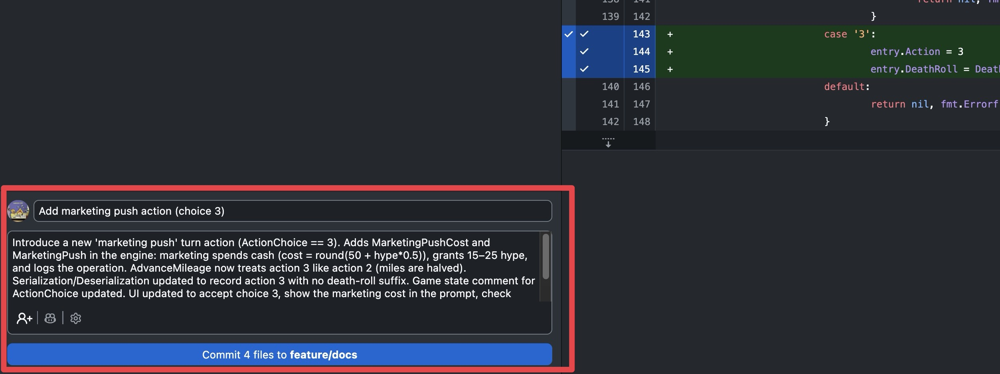
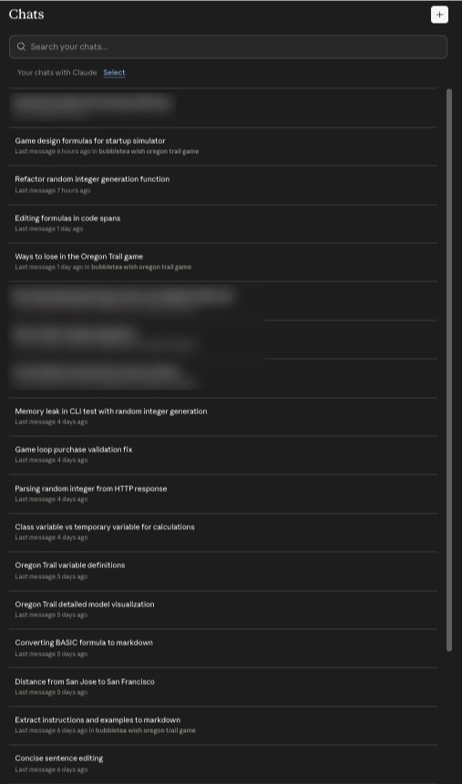

# AI Uses

## Days 0–4

- To figure out the game flow and gameplay logic for Oregon Trail, I built a CLI version based on the original BASIC game and an API client for random.org.
  - [My Oregon Trail CLI repo](https://github.com/jwc20/oregon-trail-go)
  - [The original BASIC game and Python version](https://github.com/philjonas/oregon-trail-1978-python)

- Very little AI was used during this stage; when it was, it was to translate some of the confusing BASIC code.
- AI was not used to brainstorm gameplay or feature ideas.
- GitHub Desktop's built-in AI was used to generate commit messages throughout the project.
  - 

## Day 5

- Claude Opus (chat) and Claude Code were used:
  - to convert the CLI game to a Bubble Tea/Wish TUI game (mostly for TUI styling and layout),
  - [to refactor and reorganize the code structure](journal/20260410.md)

- Game prompts were written using Claude Opus.

## Days 6–7

- Claude Opus (chat) was used to organize journal/idea files and pen-and-paper notes.

- After finishing the core game logic and TUI implementation, Claude Code was used to create additional features:

  - [Implement SQLite persistence and enhance game state management (#5)](https://github.com/jwc20/svt/commit/d976eaec2ec28119e1deda0d65f7de8b37f9a09b)
  - [Implement leaderboard UI (#6)](https://github.com/jwc20/svt/commit/f542284a9866b595c25f70b17ef9c45be4655573)
  - Hacker News Algolia API client
  - Third action (Marketing Push)

- Tests not in `engine_test.go` and `rand_test.go` were written using Claude Code.