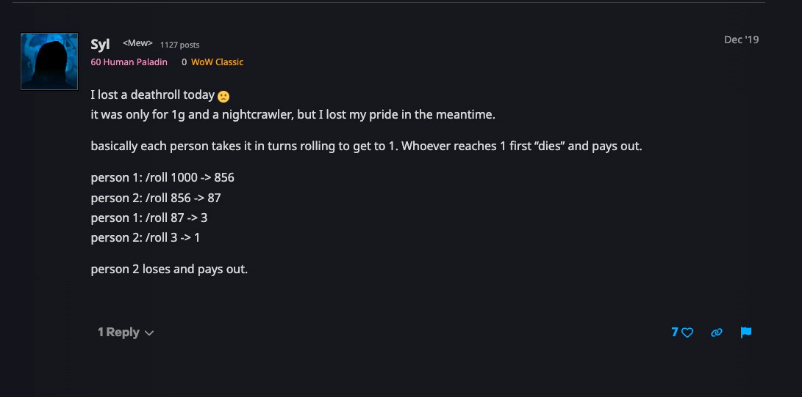

# Game Design

**Starting State:**
- Cash: 1500
- Hype: 50 + rand(0..50)
- TechDebt: 0
- BugCount: 0
- TotalMiles: 0
- UserCount: hype * 10

**Win Condition:** Reach 2040 totalMiles (San Francisco)

**Lose Conditions:**
- Cash < 0 → bankrupt
- Hype < 5 → ghost town
- TechHealth < 0 → total system failure

---

**Server Options:**

| Option | Monthly Cost | Per User Cost | Tech Debt/turn | Bug/turn |
|---|---|---|---|---|
| AWS Fargate | 0 | 0.05 | +0 | +0 |
| AWS EC2 | 40 | 0 | +1 | rand(0..1) |
| AWS Lambda | 0 | 0.03 | +2 | rand(0..2) |
| Lenovo ThinkPad | 0 | 0 | +4 | rand(0..3) |

**Database Options:**

| Option | Monthly Cost | Per User Cost | Tech Debt/turn | Bug/turn |
|---|---|---|---|---|
| AWS Aurora | 0 | 0.04 | +0 | +0 |
| AWS RDS | 30 | 0 | +1 | rand(0..1) |
| SQLite | 0 | 0 | +3 | rand(0..2) |

**API Gateway:** $129/month — applies if any AWS service (server or database) is selected. Does not apply if both choices are non-AWS (ThinkPad + SQLite).

---

**Per-Turn Formulas:**

**Mileage:**
`miles += 140 + hype/5 + rand(-20..20)`

**Monthly Cash Burn:**
`cashUsed = server.monthlyCost + db.monthlyCost + (server.perUser + db.perUser) * userCount + apiGatewayCost`

Where `apiGatewayCost = 129` if either server or database is an AWS service, otherwise `0`.

**Monthly Revenue:**
`revenue = hype * 1.5 + rand(0..hype) + randomEvent`

**Hype Decay:**
`hype = hype - 3 - bugCount/2 + rand(-5..5)`

**Tech Debt:**
`techDebt += totalMiles/200 + server.debtMod + db.debtMod + rand(0..3)`

**Tech Health (derived):**
`techHealth = 100 - techDebt - bugCount * 3`

**Bug Generation:**
`newBugs = floor(totalMiles/400) + server.bugMod + db.bugMod`

**User Count:**
`userCount = hype * 10`

**Net Cash:**
`cash = cash - cashUsed + revenue`

---

**Incident System:**
- Check: `survived = techHealth > 10 + rand(0..5)`
- Fail: `hype -= rand(10..30)`, `bugCount += rand(1..3)`

---

**Random Events (roll rand(0..100) each turn):**

| Roll | Event | Effect |
|---|---|---|
| 0-5 | DNS outage — site unreachable for hours. | `miles -= 15 + rand(0..10)` `hype -= rand(5..10)` |
| 6-10 | Lead engineer quits. | `techDebt += 10 + rand(0..5)` `bugCount += rand(1..3)` |
| 11-14 | Cofounder's laptop stolen at coffee shop. | `cash -= 100 + rand(0..75)` `techDebt += rand(3..6)` |
| 15-19 | DDoS attack! | `miles -= 25` `hype -= rand(10..20)` |
| 20-24 | AWS bill surprise — forgot to turn off test instances. | `cash -= 150 + rand(0..100)` |
| 25-28 | Database corruption — loss of user data. | `hype -= 15 + rand(0..15)` `bugCount += rand(2..4)` |
| 29-32 | Competitor launches same feature. Users jump ship. | `hype -= 10 + rand(0..10)` `miles -= rand(5..15)` |
| 33-35 | Security breach — passwords leaked. | `hype -= 20 + rand(0..10)` `cash -= 50 + rand(0..50)` `techDebt += rand(3..5)` |
| 36-38 | npm dependency breaks — half the app crashes. | `bugCount += 5 + rand(0..3)` `techDebt += rand(2..5)` |
| 39-41 | Intern pushes to prod on Friday night. | `bugCount += rand(3..6)` `hype -= rand(5..10)` |
| 42-44 | Office landlord raises rent. | `cash -= 75 + rand(0..50)` |
| 45-49 | Ransomware on a dev machine. | `if (techDebt < 30) { cash -= 250 + rand(0..150) } else { techDebt += rand(2..4) }` |
| 50-54 | Tech blog writes a positive review! | `hype += 10 + rand(0..10)` |
| 55-58 | Post goes viral on Hacker News. | `hype += 15 + rand(0..15)` `miles += rand(5..15)` |
| 59-62 | VC cold-emails you after seeing your product. | `cash += 250 + rand(0..250)` |
| 63-65 | Rich uncle sends a check. | `cash += 150 + rand(0..100)` |
| 66-68 | Open source contributor fixes 3 bugs for free. | `bugCount -= 3` `techDebt -= rand(2..5)` |
| 69-71 | Win a startup pitch competition. | `cash += 200 + rand(0..100)` `hype += rand(5..10)` |
| 72-74 | Influencer tweets about your product. | `hype += 10 + rand(0..10)` |
| 75-100 | Nothing happens. | No effect |

---

**Negative Events:**

| Event | Effect |
|---|---|
| DNS outage — site unreachable for hours. | `miles -= 15 + rand(0..10)` `hype -= rand(5..10)` |
| Lead engineer quits. | `techDebt += 10 + rand(0..5)` `bugCount += rand(1..3)` |
| Cofounder's laptop stolen at coffee shop. | `cash -= 100 + rand(0..75)` `techDebt += rand(3..6)` |
| DDoS attack! | `miles -= 25` `hype -= rand(10..20)` |
| AWS bill surprise — forgot to turn off test instances. | `cash -= 150 + rand(0..100)` |
| Database corruption — loss of user data. | `hype -= 15 + rand(0..15)` `bugCount += rand(2..4)` |
| Competitor launches same feature. Users jump ship. | `hype -= 10 + rand(0..10)` `miles -= rand(5..15)` |
| Security breach — passwords leaked. | `hype -= 20 + rand(0..10)` `cash -= 50 + rand(0..50)` `techDebt += rand(3..5)` |
| npm dependency breaks — half the app crashes. | `bugCount += 5 + rand(0..3)` `techDebt += rand(2..5)` |
| Intern pushes to prod on Friday night. | `bugCount += rand(3..6)` `hype -= rand(5..10)` |
| Office landlord raises rent. | `cash -= 75 + rand(0..50)` |
| Ransomware on a dev machine. | If `techDebt < 30`: `cash -= 250 + rand(0..150)`. Otherwise: `techDebt += rand(2..4)` |
| SSL certificate expires — site shows security warning. | `hype -= rand(5..15)` `bugCount += 1` |
| Key API you depend on deprecates without warning. | `techDebt += rand(5..10)` `miles -= rand(10..20)` |
| Cofounder disagrees on direction — morale tanks. | `hype -= rand(10..20)` |
| Power outage fries the ThinkPad. | If server is ThinkPad: `techDebt += 15` `bugCount += rand(3..5)`. Otherwise: no effect |
| Customer data GDPR complaint. | `cash -= 100 + rand(0..100)` `hype -= rand(5..10)` |
| GitHub repo accidentally made public — code leaked. | `hype -= rand(5..15)` `techDebt += rand(2..4)` |

**Positive Events:**

| Event | Effect |
|---|---|
| Tech blog writes a positive review! | `hype += 10 + rand(0..10)` |
| Post goes viral on Hacker News. | `hype += 15 + rand(0..15)` `miles += rand(5..15)` |
| VC cold-emails you after seeing your product. | `cash += 250 + rand(0..250)` |
| Rich uncle sends a check. | `cash += 150 + rand(0..100)` |
| Open source contributor fixes 3 bugs for free. | `bugCount -= 3` `techDebt -= rand(2..5)` |
| Win a startup pitch competition. | `cash += 200 + rand(0..100)` `hype += rand(5..10)` |
| Influencer tweets about your product. | `hype += 10 + rand(0..10)` |
| YC invites you to interview. | `hype += 20 + rand(0..10)` `cash += 100` |
| College friend joins as CTO — works for equity. | `techDebt -= rand(5..10)` `bugCount -= rand(1..3)` |
| Product Hunt launch day — #1 of the day! | `hype += 25 + rand(0..15)` `miles += rand(10..20)` |
| AWS credits grant approved. | `cash += 200 + rand(0..100)` |
| User writes a glowing Twitter thread about your product. | `hype += rand(5..15)` |
| Lucky break — find a free coworking space for 3 months. | `cash += 50` |

---

**Route (12 Turns):**
1. San Jose → 2. Santa Clara → 3. Sunnyvale → 4. Mountain View → 5. Palo Alto → 6. Menlo Park → 7. Redwood City → 8. San Mateo → 9. Hillsborough → 10. San Bruno → 11. Daly City → 12. San Francisco

---

**Actions (pick one per turn):**

1. Push forward — advance miles normally, tech debt accumulates normally
2. Fix bugs — miles halved, bugCount -= rand(2..5), techDebt -= rand(1..3)
   - fixing bug completely is determined if winning in a [death roll](https://eu.forums.blizzard.com/en/wow/t/deathrolling/112260/7)

   
   
**End of turn (always happens):**

1. Cash burn deducted
2. Revenue collected
3. Hype decay applied
4. Random event rolled

---

## End Game Scoring

**Score = cash + (hype * 10) + (techHealth * 5) - (totalTurns * 20) + serverBonus + dbBonus**

**Server Score Bonus:**

| Option | Bonus |
|---|---|
| Lenovo ThinkPad | +200 |
| AWS Lambda | +100 |
| AWS EC2 | +50 |
| AWS Fargate | +0 |

**Database Score Bonus:**

| Option | Bonus |
|---|---|
| SQLite | +150 |
| AWS RDS | +75 |
| AWS Aurora | +0 |

