# April 6, 2026 Monday

## Req

1. Game loop turn/days with at least 3 options
2. Track at least 3 stats per turn and winning/losing conditions
3. at least 10 real locations
4. Events & Choices
   1. Diverse set of events
   2. choices that matter
   3. random or semi-random events
5. Use public web API

## Ideas

- Each cities can be a turn/day
  - use public API to get list of cities from sj -> sf
- call weather API for random events
  - what if all sunny days?
    - => add random rainy days
    - 
- https://github.com/public-apis/public-apis
- Each turn/day has 24 hours
  - Use google CLI to add to calendar
- Trackables/Resources
  - Cash
  - Mood/Morale (scale of 1-4)
  - Hydration
  - Influence/Networking/Amount of VC's known
  - AWS Credit (Primary Health)
    - Lambda/EC2/LightSail
    - RDS/Aurora - Database
    - API Gateway
    - Account can be suspended if not paid -> Game Over

- Team (instead of dying, they quit suddenly)
  - CEO
  - Engineering Manager
  - Founding Backend
  - Founding Frontend
  - Social Media Person

- Difficulty
  - Easy: Graduated from Stanford with CS degree
    - +Funding, +Influence
  - Medium: Graduated from a UC with CS degree
  - Hard: Graduated from a UC but with non-CS degree and went to Bootcamp
  - Hardcore: Self-taught
    - Little funding (bootstrap), no influence

- The original Oregon Trail was a gigantic if/else, while loop

- Resources
  1. Oxen -> AWS Credit
  2. Food -> Food
  3. Ammo -> Influence/Hype 
  4. Clothing -> Users 
  5. Misc. Supplies/medicines -> Morale 
  6. Cash -> Cash

- Public APIs
  - https://numbersapi.com/#random/trivia
  - https://math.tools/api/numbers/
  - https://www.random.org/integers/
  - https://www.climatiq.io/docs/api-reference

## Some Links

- https://github.com/clintmoyer/oregon-trail
- https://github.com/topherPedersen/OregonTrail1978/blob/master/oregon.bas
- https://intfiction.org/t/is-oregon-trail-a-text-game/62652/5
- https://github.com/philjonas/oregon-trail-1978-python

## Classic-Game-Postmortem-Oregon-Trail

https://www.gdcvault.com/play/1024251/Classic-Game-Postmortem-Oregon-Trail

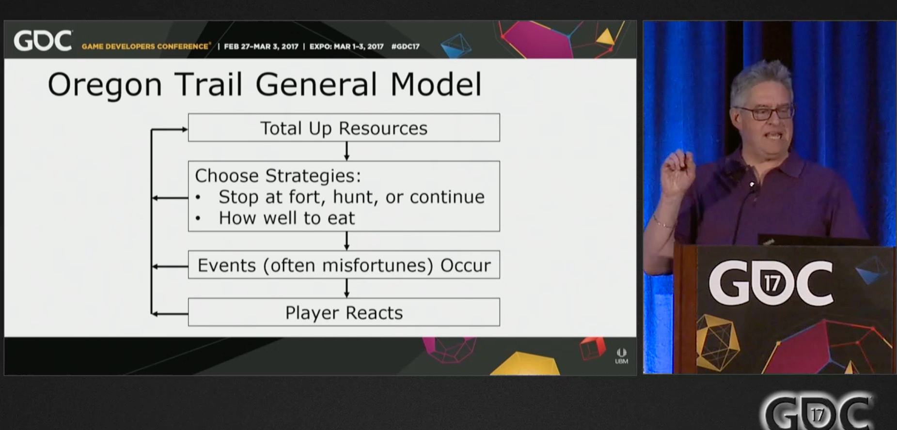

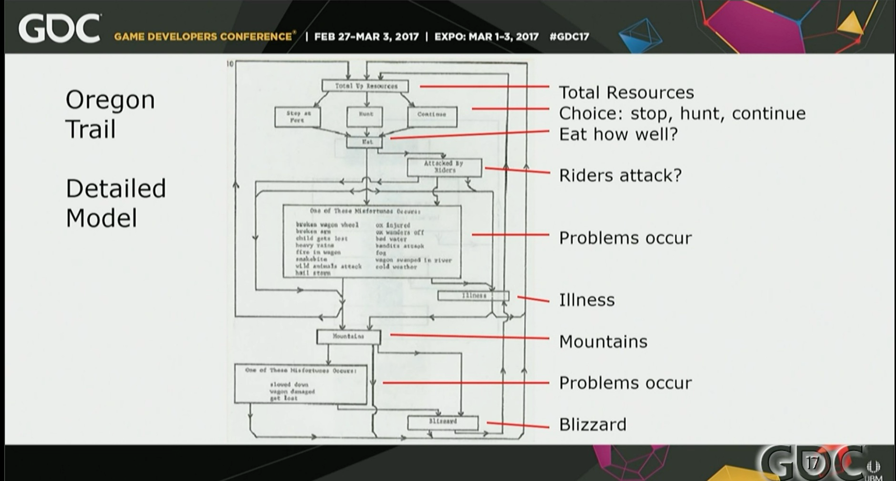

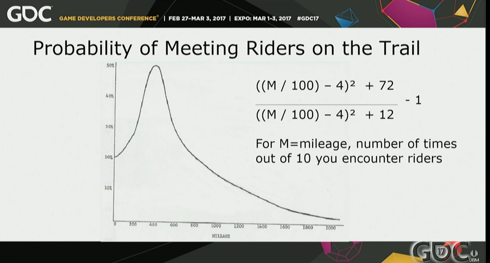

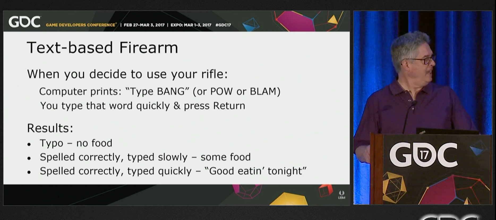

---

## Gameplay

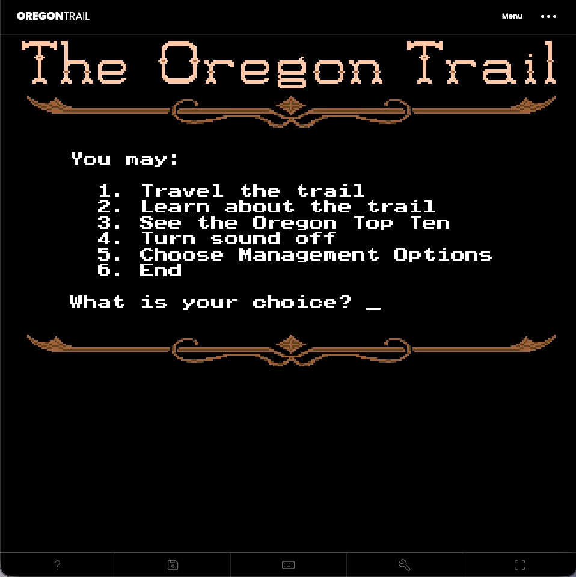

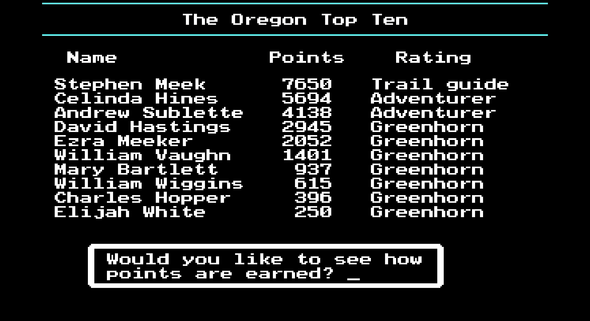

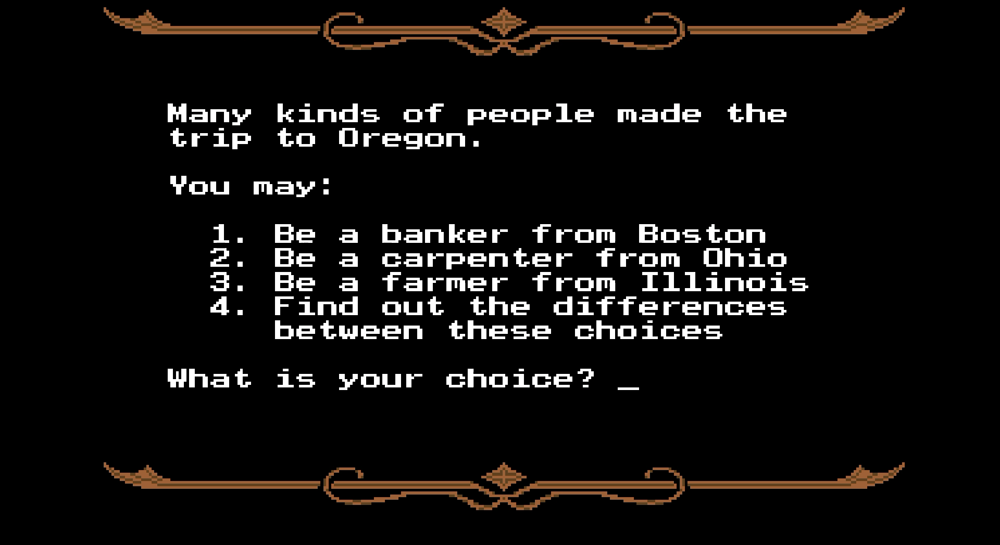

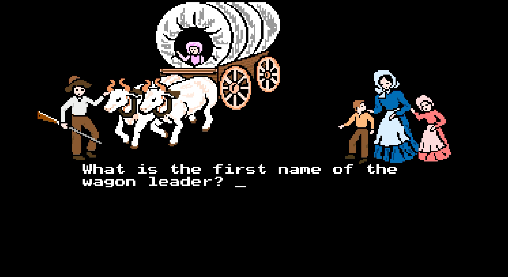

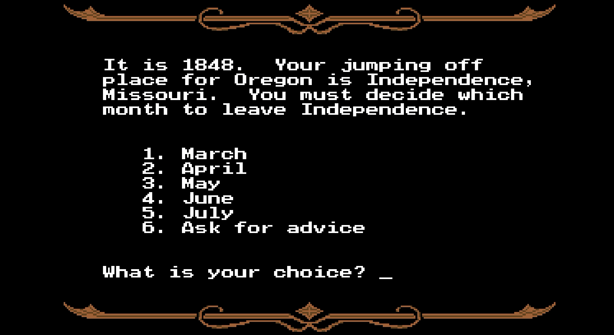

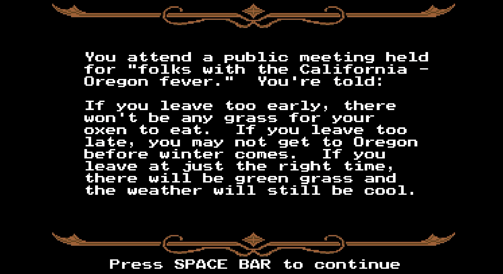

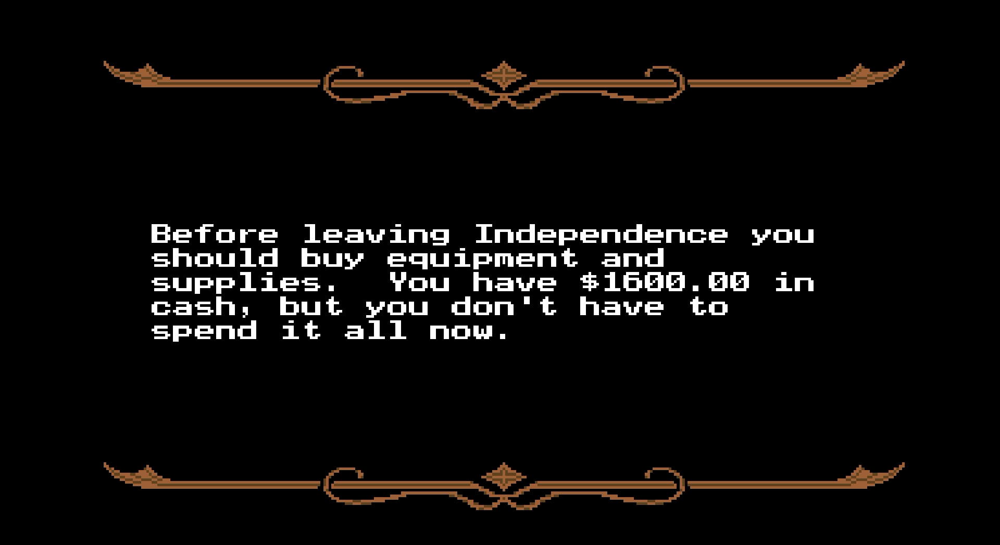

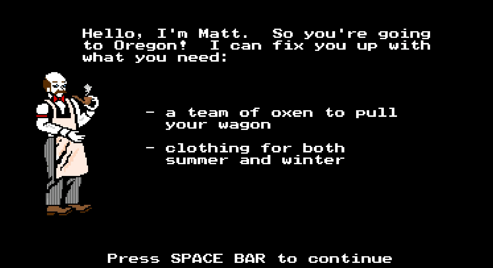

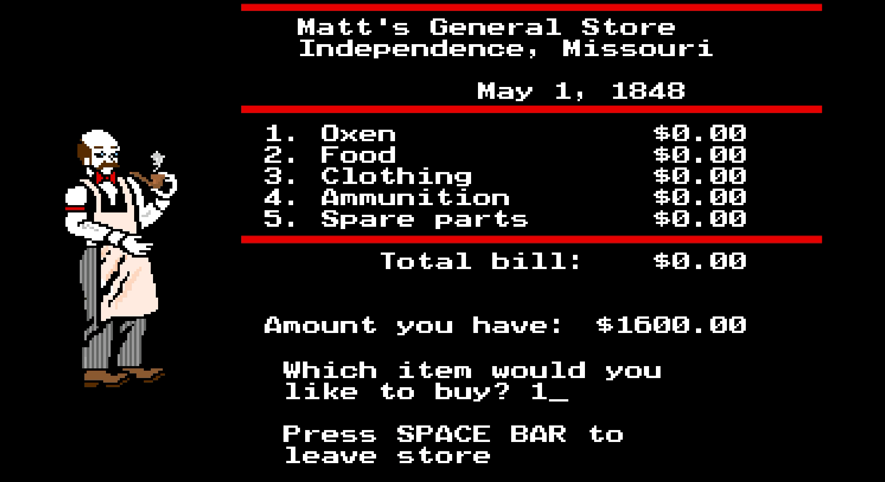