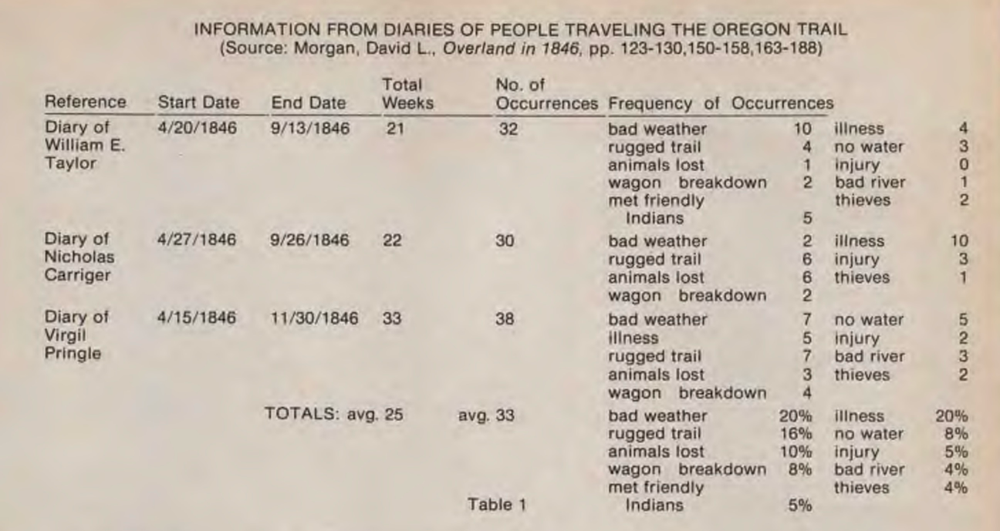

# April 7, 2026 Tuesday

## Notes from Don Rawitsch's Creative Computing Article (1973)

- Original Oregon Trail simulates trip over the Oregon Trail from Independence, Missouri to Oregon City, Oregon in 1847
  - Family of five covers 2040 miles Oregon Trail in 5-6 months
  - The distance from San Jose to San Francisco is approximately 50 miles by road (via US-101 or I-280), and about 42 miles as the crow flies.
- The Oregon Trail travelers (real historic, not in the game) averaged 15-25 miles per day according to _Ox Team Days_
  - In the game, players make 175-200 miles every 2 week period

| Item | Amount per Adult | Cost |
|------|-----------------|------|
| Flour | 150 lbs. | — |
| Bacon | 25 lbs. | — |
| Sugar | 25 lbs. | 18¢/lb |
| Coffee | 15 lbs. | — |
| Salt | — | $3.00/barrel |
| Calico | — | 15¢/yd |
| Oxen team (8) | — | ~$200 |
| Food stock (family of 5) | — | ~$175 total |

- The occurrence of misfortunes is based on the probabilities below the table

---

## Riders Attack formula

$$\text{rand} \times 10 > \frac{\left(\frac{M}{100} - 4\right)^2 + 72}{\left(\frac{M}{100} - 4\right)^2 + 12} - 1$$

where $\text{rand} \in [0, 1)$ is a uniform random number (from `RND(-1)` in BASIC).

---

- row 1. total up resource
- row 2. stop at fort, hunt, continue
- row 3. eat
- row 4. attacked by riders
- row 5. misfortunes
- row 6. illness
- row 7. mountains
- row 8. misfortunes
- row 9. blizzard

---

- created mermaid diagram

--- 

## REM ***IDENTIFICATION OF VARIABLES IN THE PROGRAM***
- REM A = AMOUNT SPENT ON ANIMALS
- REM B = AMOUNT SPENT ON AMMUNITION
- REM B1 = ACTUAL RESPONSE TIME FOR INPUTTING "BANG"
- REM B3 = CLOCK TIME AT START OF INPUTTING "BANG"
- REM C = AMOUNT SPENT ON CLOTHING
- REM C1 = FLAG FOR INSUFFICIENT CLOTHING IN COLD WEATHER
- REM C$ = YES/NO RESPONSE TO QUESTIONS
- REM D1 = COUNTER IN GENERATING EVENTS
- REM D3 = TURN NUMBER FOR SETTING DATE
- REM D4 = CURRENT DATE
- REM D9 = CHOICE OF SHOOTING EXPERTISE LEVEL
- REM E = CHOICE OF EATING
- REM F = AMOUNT SPENT ON FOOD
- REM F1 = FLAG FOR CLEARING SOUTH PASS
- REM F2 = FLAG FOR CLEARING BLUE MOUNTAINS
- REM F9 = FRACTION OF 2 WEEKS TRAVELED ON FINAL TURN
- REM K8 = FLAG FOR INJURY
- REM L1 = FLAG FOR BLIZZARD
- REM M =TOTAL MILEAGE WHOLE TRIP
- REM M1 = AMOUNT SPENT ON MISCELLANEOUS SUPPLIES
- REM M2 = TOTAL MILEAGE UP THROUGH PREVIOUS TURN
- REM M9 = FLAG FOR CLEARING SOUTH PASS IN SETTING MILEAGE
- REM P = AMOUNT SPENT ON ITEMS AT FORT
- REM R1 = RANDOM NUMBER IN CHOOSING EVENTS
- REM S4 = FLAG FOR ILLNESS
- REM S5 = ""HOSTILITY OF RIDERS"" FACTOR
- REM S6 = SHOOTING WORD SELECTOR
- REM S$ = VARIATIONS OF SHOOTING WORD
- REM T = CASH LEFT OVER AFTER INITIAL PURCHASES
- REM T1 = CHOICE OF TACTICS WHEN ATTACKED
- REM X = CHOICE OF ACTION FOR EACH TURN
- REM X1 = FLAG FOR FORT OPTION
