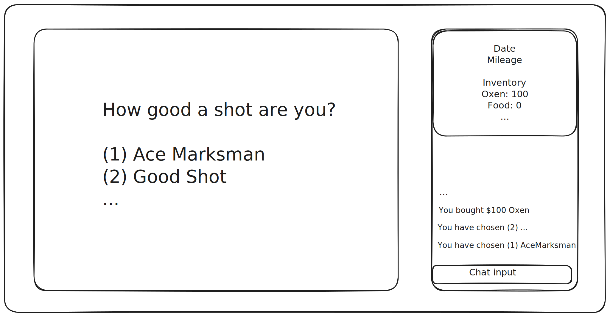
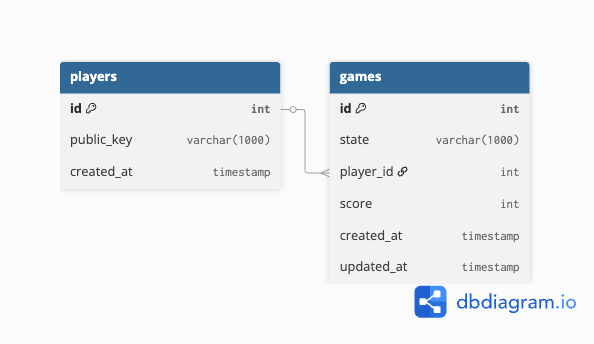

# April 9, 2026 Wednesday


## Journal

- Starting to integrate Bubble Tea and Wish
- Started working on the Powerpoint presentation

- Took too much time figuring out that the game logic functions (i.e. `SetShootingLevel`, `PurchaseItem`,etc) should not be methods in a struct (should not be OOP).
  - It needs to be plain functions so that it can be called from the Bubbel Tea TUI.

---

### Notes on game state:

```go
type GameState struct {
    Player    Player
    Inventory Inventory
    ...
}

type Player struct {
    Cash          int
    ShootingLevel int
}

type Inventory struct {
    Oxen          int
    Food          int
    ...
}
```
- No specific design pattern was chosen (i.e. state machine pattern, observer pattern, etc), 
- because i often find it to be overkill and one big state struct/object is hard to understand.
  - luckily, by default Go follows the "composition over inheritance", which makes the structs modular.
  


---

## important formulas

### Food Consumption (ApplyEating): 
- `foodUsed = 8 + 5 * eatingChoice`
  - Poorly (1): 13
  - Moderately (2): 18
  - Well (3): 23
### Mileage (AdvanceMileage): 
- `miles = 200 + (Oxen - 220) / 5 + rand(1..10) * 10`
  - If hunting (`ActionChoice ≠ 1`): `miles /= 2`

### Ailment Survival (HandleAilment):
- Death threshold: `Miscellaneous < 5`
-   Treatment cost: `5 + rand(0..4)`

### Event Probabilities (GenerateEvent): 
- `roll = rand(1..100)`

| Roll | Event | Effects |
|------|-------|---------|
| 1–6 (6%) | Wagon breakdown | `mileage -= 15+rand(0..9), misc -= 8+rand(0..4)` |
| 7–11 (5%) | Ox injured | `mileage -= 25, oxen -= 20` |
| 12–15 (4%) | Broken arm | `Injured=true, misc -= 5+rand(0..3)` |
| 16–20 (5%) | Wild animals | `ammo -= 10+rand(0..4); if ammo<0: food -= 30+rand(0..19)` |
| 21–25 (5%) | Cold weather | `if clothing<20: Ill=true` |
| 26–30 (5%) | Heavy rains | `mileage -= 10+rand(0..4), food -= 10, ammo -= 5+rand(0..4), misc -= 5+rand(0..4)` |
| 31–33 (3%) | Bandits | `food -= 10+rand(0..9), cash -= 10+rand(0..14) (min 0)` |
| 34–36 (3%) | Fire | `food -= 40+rand(0..29), ammo -= 20+rand(0..19), misc -= 10+rand(0..9)` |
| 37–40 (4%) | Helpful Indians | `food += 14+rand(0..4)` |
| 41–100 (60%) | Nothing | — |


### End Conditions (CheckEndConditions):

- Starvation: `Food < 0`
- Arrival: `Mileage >= 2040`

---


## overall game loop (**Phases**)

1. Choose shooting skill (1–5).

2. Purchase supplies in sequence: oxen ($200–300), food (100–200), ammo (50–100), clothing (50–100), misc (50–100).

3. Enter the main loop (each turn):
   
    a. Choose action: continue on trail or hunt for food.
   
    b. Choose eating level: poorly, moderately, or well.
   
    c. Mileage advances (halved if hunting).

    d. A random event may fire (wagon breakdown, bandits, weather, etc.).

    e. If injured/ill, ailment check determines survival.

    f. Check for starvation (food < 0) or arrival (mileage >= 2040).
   
4. Game ends with win, starvation, or death from an ailment.


## Ideas

- The bubble tea game should have three screens:
    - Status
    - Game
    - Chat

- notation idea
  - game history/state/status is stored in a string (SVT notation)
  - `3;c1e3/c1e2/c2e1/..../..../..../..../..../..../..../..../....;200/100/100/60/50/1 - 0/2/3/././././././././.`
    - `[TurnNumber];[turn1: choice1/eating3]/[turn2: choice1/eating2]/..../....;[oxen/food/ammo/clothing/misc/shootingLevel] - [occurences0/occ2/occ3/...]`
  - since the game has total up to 12 turns, 
    - there are 12 possible states
      - `c1e3/c1e2/c2e1/..../..../..../..../..../..../..../..../....`
    - there are 12 occurences that can be triggered after the turn
      - `0/2/3/././././././././.`
  - The benefit of using a string to store game state/history is that it can be easily parsed and manipulated and doesnt require multiple columns in the database
    - so the game state can be stored in a single column
    - game table columns:
      - id int
      - state varchar(1000)
      - player_id int
      - created_at timestamp
      - updated_at timestamp
  - https://github.com/jwc20/pyttt/blob/8c9e4536d868f3c6f3bdc256dac3190a0a51590b/pyttt/game.py#L62
  - https://en.wikipedia.org/wiki/Forsyth%E2%80%93Edwards_Notation

## UI Design

### Old UI


### New UI




## ERD

