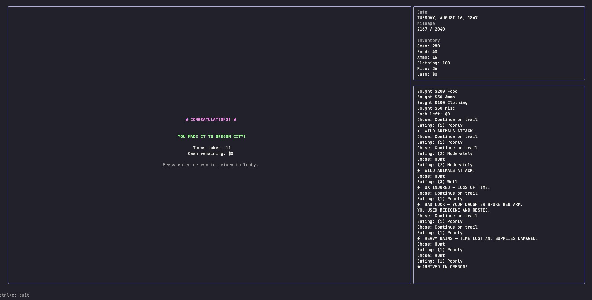
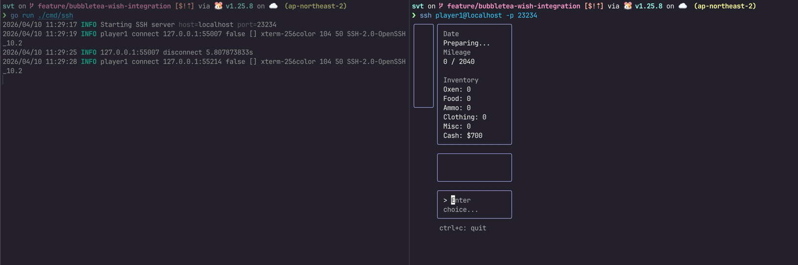
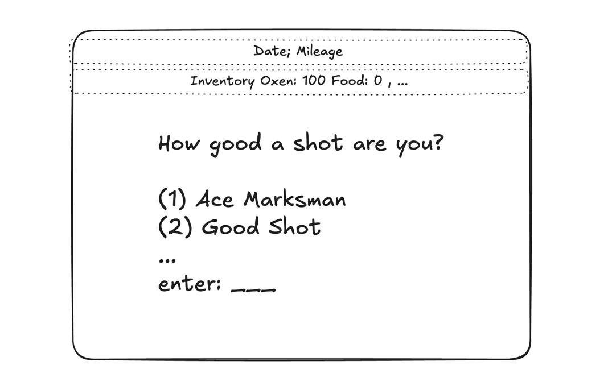

# April 10, 2026 Friday




## Journal

https://github.com/user-attachments/assets/72bdaeb7-a6a3-4dab-9836-4c9ff0acfead

- 

- the ui with multiple panels was hard to maintain, decided to use a single panel which is simpler to implement.


### Code Refactoring -> Restructuring

- claude code was used to decompose the code into smaller functions.

- current structure:

```
  Current structure:
  svt/
  ├── cmd/
  │   ├── cli/main.go          (empty - placeholder)
  │   └── ssh/main.go          (SSH server entry point)
  ├── notes/                   (journal, research docs)
  ├── game.go                  (game state, logic, events)
  ├── game_model.go            (Bubble Tea UI for gameplay)
  ├── game_test.go
  ├── lobby_model.go           (Bubble Tea UI for lobby)
  ├── message.go               (inter-model messages)
  ├── root_model.go            (root model / view router)
  ├── styles.go                (lipgloss styles)
  ├── testing.go               (StubGameStore)
  ├── utils.go                 (random number generation)
  ├── utils_test.go
  ├── go.mod / go.sum
  └── .env / .ssh/ / .idea/

  The main issues: game logic, UI models, styles, random utilities, and store interfaces are all in one flat package. As the game grows (more events, phases, UI screens), this will get unwieldy.
```

- new structure:

```
svt/
  ├── cmd/
  │   ├── cli/
  │   │   └── main.go                 # CLI entry point (local play)
  │   └── ssh/
  │       └── main.go                 # SSH server entry point
  │
  ├── internal/
  │   ├── engine/
  │   │   ├── state.go                # GameState, Player, Inventory, TripState, Flags structs
  │   │   ├── phase.go                # GamePhase enum, phase constants
  │   │   ├── actions.go              # SetShootingLevel, PurchaseItem, FinalizePurchases,
  │   │   │                           # ApplyEating, AdvanceMileage
  │   │   ├── events.go               # GenerateEvent, HandleAilment
  │   │   ├── query.go                # IsStarved, IsArrived, NeedsAilmentCheck, DateName
  │   │   ├── store.go                # GameStore interface
  │   │   └── engine_test.go          # tests for all engine logic
  │   │
  │   ├── ui/
  │   │   ├── styles.go               # all lipgloss style definitions
  │   │   ├── message.go              # StartGameMsg, BackToLobbyMsg, GameLogMsg
  │   │   ├── root.go                 # RootModel (view router)
  │   │   ├── lobby.go                # LobbyModel
  │   │   ├── game.go                 # GameModel (UI model, prompt setters, View)
  │   │   └── game_test.go            # UI-level tests if needed
  │   │
  │   └── rand/
  │       ├── rand.go                 # GetRandomInt, random.org client logic
  │       └── rand_test.go
  │
  ├── notes/                          # (unchanged - journal, research)
  ├── go.mod
  ├── go.sum
  └── README.md
```


---

## TODO

- [x] Finish Bubble Tea and Wish integration

---

---

---

---


## Ideas so far 

- instead of setting shooting level, set soft skills/communication level at the start of the game

### Route (12 Turns/Locations)

1. San Jose → 2. Santa Clara → 3. Sunnyvale → 4. Mountain View → 5. Palo Alto → 6. Menlo Park → 7. Redwood City → 8. San Mateo → 9. Hillsborough → 10. San Bruno → 11. Daly City → 12. San Francisco

---

### Difficulty Levels (replaces Shooting Expertise)

- **Easy:** Stanford CS grad — bonus funding & influence
- **Medium:** UC school, CS degree
- **Hard:** UC school, non-CS degree + bootcamp
- **Hardcore:** Self-taught — minimal funding (bootstrap), no influence

**Soft skills/communication level** chosen at game start (replaces shooting level, 1–5 scale).

---

### Resources (Oregon Trail → SV Trail Mapping)

| Oregon Trail | Silicon Valley Trail |
|---|---|
| Oxen | AWS Credits (primary health — Lambda, EC2, RDS, API Gateway) |
| Food | Food |
| Ammo | Influence / Hype |
| Clothing | Users |
| Misc. Supplies | Morale |
| Cash | Cash |

**Purchasing:** Done by dollar amount, not by count (faithful to original). Budget: $900 total, allocated across categories in sequence.

**Losing conditions:** AWS account suspended (unpaid) = game over. Food < 0 = starvation. Morale hits zero.

**Winning condition:** Reach San Francisco (mileage >= target).

---

### Team (replaces "family of five" — they quit instead of dying)

- CEO
- Engineering Manager
- Founding Backend Engineer
- Founding Frontend Engineer
- Social Media Person

---

### Turn Structure (per city)

Each turn follows these phases:

1. **Choose action:** Continue on trail, hunt (network/hustle), or stop at a fort (co-working space?)
2. **Choose eating level:** Poorly / Moderately / Well
3. **Mileage advances** (halved if hunting/networking)
4. **Random event fires** (see event table)
5. **Ailment/illness check** if injured
6. **Check end conditions** (starvation, arrival, death)

---

### Formulas (carried from original)

- **Food consumption:** `foodUsed = 8 + 5 × eatingChoice`
- **Mileage:** `miles = 200 + (Oxen - 220)/5 + rand(1..10)×10` (halved if not continuing)
- **Ailment survival:** Death if `misc < 5`; treatment costs `5 + rand(0..4)`

---

### Event Table (re-skinned for SV)

| Roll | Oregon Trail Event | SV Trail Equivalent | Effects |
|---|---|---|---|
| 1–6 (6%) | Wagon breakdown | Server outage | mileage −15, misc −8 |
| 7–11 (5%) | Ox injured | AWS bill spike | mileage −25, AWS credits −20 |
| 12–15 (4%) | Broken arm | Founder burnout | Injured=true, misc −5 |
| 16–20 (5%) | Wild animals | Competitor launches | Influence −10; if low, Users −30 |
| 21–25 (5%) | Cold weather | Bad press / Twitter drama | If Users < 20, Ill=true |
| 26–30 (5%) | Heavy rains | Regulatory trouble | mileage −10, food −10, influence −5, misc −5 |
| 31–33 (3%) | Bandits | Talent poached by FAANG | Food −10, Cash −10 |
| 34–36 (3%) | Fire | Data breach | Food −40, Influence −20, Misc −10 |
| 37–40 (4%) | Helpful Indians | Angel investor appears | Food +14 |
| 41–100 (60%) | Nothing | Smooth sailing | — |

---

### Mid-Game Twist: The AI Moment

- Game is set before December 2022 (pre-ChatGPT)
- Around turn 6–7, player chooses: **embrace AI or not**
- **Embrace AI →** boost to Influence and creativity
- **Reject AI →** Influence drops

---

### API Integrations

- **HN Algolia API** — calculate Influence/Hype based on startup name (result count, comments, pages)
- **Weather API** — drive random event probabilities (use wind speed/rain since California is mostly sunny; add random rainy days as fallback)
- **Numbers API** (`numbersapi.com`) — trivia flavor text
- **Random.org** — true random integers for event rolls

---

### Game State Storage (SVT Notation)

Inspired by chess FEN notation — entire game state in one string:

```
[TurnNumber];[turn1:choice/eating]/[turn2:choice/eating]/.../....;[oxen/food/ammo/clothing/misc/skillLevel] - [event1/event2/.../...]
```

Example: `3;c1e3/c1e2/c2e1/..../..../..../..../..../..../..../..../....;200/100/100/60/50/1 - 0/2/3/././././././././.`

**Benefit:** Single DB column storage. Easy to parse, replay, and debug.

