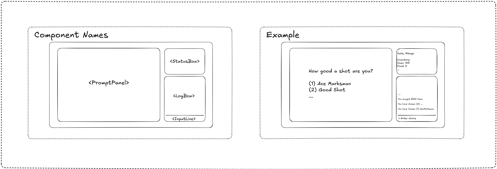

# April 11, 2026 Saturday

## UI Design, Components

## ideas

- During the start of the game, the player can choose the difficulty level.

### Resources

1. Cash
2. Hype (user count, founders morale, influence/popularity)
3. Technical (bug count, tech debt, ransomware, random events)

### Monthly cost
  - server, fixed amount
  - serverless, based on user count

### Difficulty level
  1. Cash++, Hype++, Tech++
  2. Cash+, Hype+, Tech+
  3. Cash, Hype, Tech

**Losing conditions:** The player loses if they run out of theses resources.

- Losing Scenarios:
  1. Runs out of cash from paying the monthly cost -> not enough hype to generate monthly revenue
  2. Runs out of hype -> there are no more users, the engineers are bored, etc
  3. Runs out of tech -> the program/server crashes, loses database, hackers break into the system, etc

### Monthly Revenue

- Based on the number of hype 
- Random events -> VC funding, winning the lottery, family member giving money, etc

